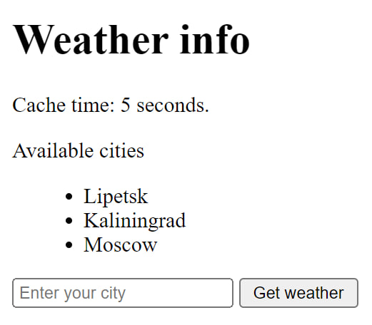
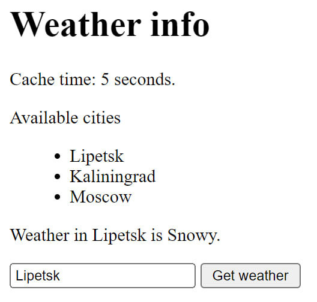
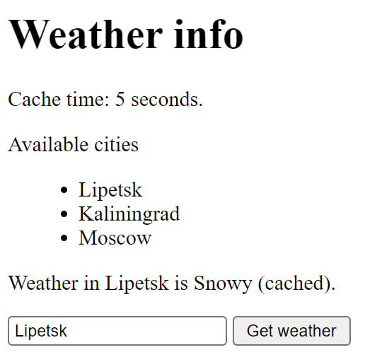

# Описание проекта
Использование Redis для кэширования запросов
получения погоды в городе.


При запросе погоды происходит просмотр БД Redis.
Если присутствует string с key = {city}, то возвращается 
значение по этому key. Иначе происходит вызов API, результат
которого сохраняется в Redis: SET {city} {weather}. 
Ключ исчезнет через 5 секунд.

При повторном запросе данные о погоде будут браться уже из Redis.

## API:

- ```GET /weather/<string:city>``` - получить погоду по названию города.

## UI:

- ```localhost:5000``` - главная страница сайта

## Демо

Пользователь вводит название города:



Пользователь получает погоду по API:



Пользователь получает погоду из кэша:



## Запуск проекта

```commandline
$ docker compose up
```
